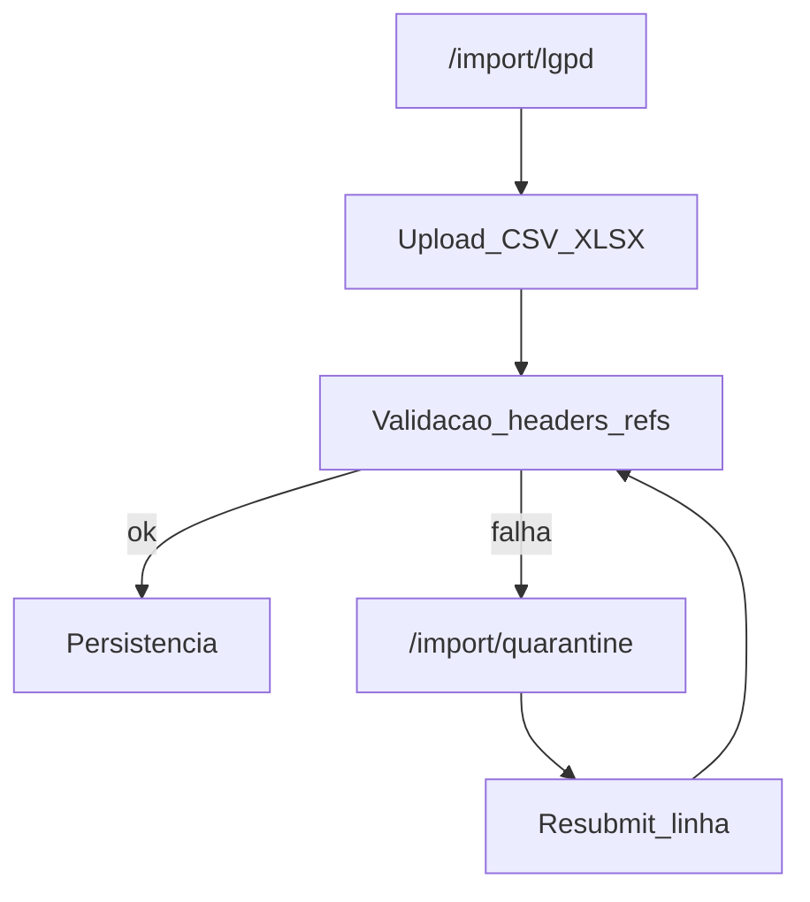

# Protótipo BF — Import LGPD

```mermaid
flowchart TD
  nav["/import/lgpd"]
  upload[Upload_CSV_XLSX]
  validate[Validacao_headers_refs]
  ok[Persistencia]
  quar["/import/quarantine"]
  resub[Resubmit_linha]
  nav --> upload --> validate
  validate -->|ok| ok
  validate -->|falha| quar --> resub --> validate
```

Telas: seletor pacientes vs amostras; preview; resultado; fila de quarentena.
