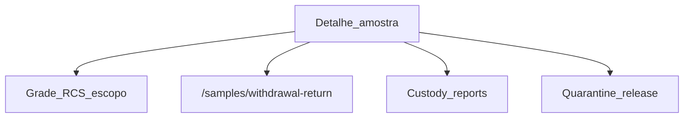

# Protótipo BF — RCS + liberação de amostras

```mermaid
flowchart TD
  sample[Detalhe_amostra]
  rcs[Grade_RCS_escopo]
  withdraw["/samples/withdrawal-return"]
  custody[Custody_reports]
  qrelease[Quarantine_release]
  sample --> rcs
  sample --> withdraw
  sample --> custody
  sample --> qrelease
```

Conceito: RCS qualifica pré-analítico para contexto declarado (não validade clínica). Liberação/retirada é ato evidenciado (RF019), com auditoria.
